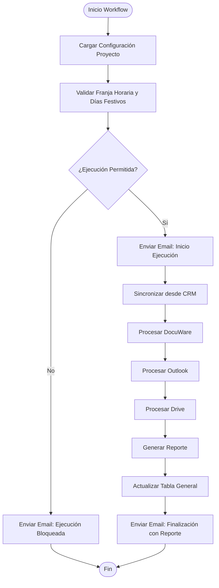
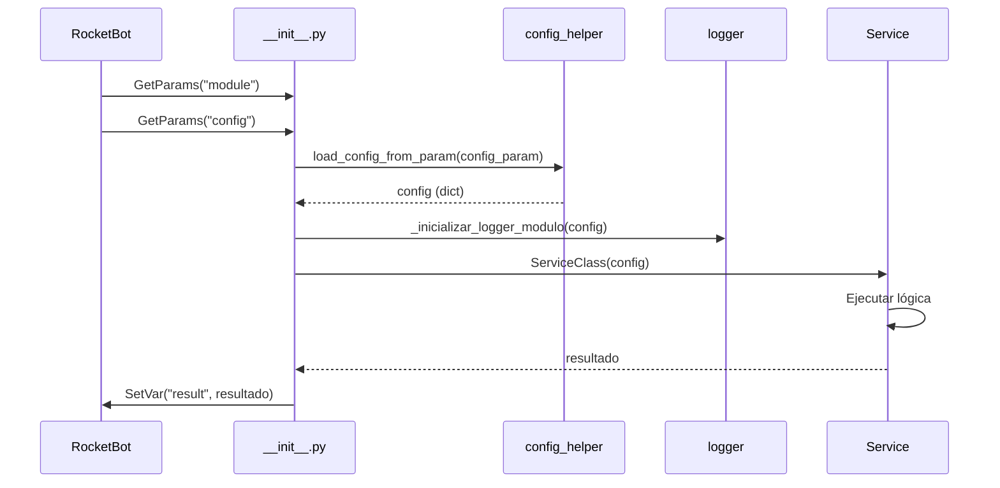
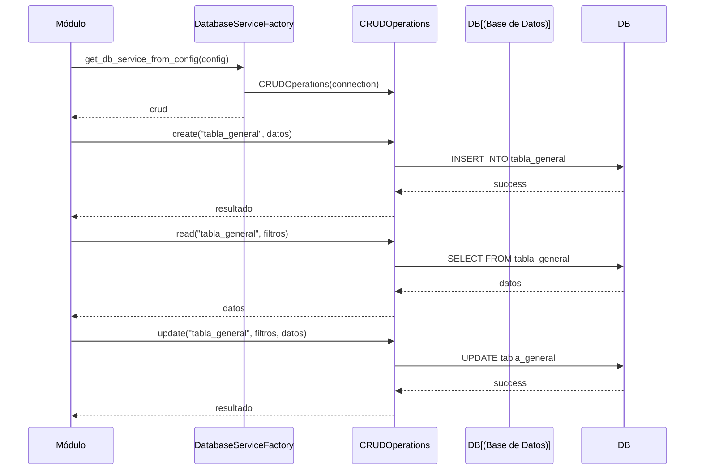

# Guía de Estructura y Mejores Prácticas - Basado en Medidas-Cautelares

Este documento proporciona un análisis detallado de la estructura del proyecto **Medidas-Cautelares** y las mejores prácticas para crear e implementar módulos nuevos. El objetivo es servir como guía para desarrollar los módulos **DocuWareApi**, **CrmDynamicsApi**, **Outlook** y **Drive** que serán orquestados desde RocketBot.

## Tabla de Contenidos

1. [Análisis de Estructura de Medidas-Cautelares](#1-análisis-de-estructura-de-medidas-cautelares)
2. [Consulta de Variables y Configuraciones](#2-consulta-de-variables-y-configuraciones)
3. [Conexión a Base de Datos](#3-conexión-a-base-de-datos)
4. [Validación de Franjas Horarias y Días Festivos](#4-validación-de-franjas-horarias-y-días-festivos)
5. [Generación de Reportes](#5-generación-de-reportes)
6. [Envío de Emails](#6-envío-de-emails)
7. [Mejores Prácticas de Módulos](#7-mejores-prácticas-de-módulos)
8. [Guía de Implementación de Módulos Nuevos](#8-guía-de-implementación-de-módulos-nuevos)
9. [Orquestación desde RocketBot](#9-orquestación-desde-rocketbot)
10. [Excepciones y Diferencias](#10-excepciones-y-diferencias)
11. [Checklist de Implementación](#11-checklist-de-implementación)

---

## 1. Análisis de Estructura de Medidas-Cautelares

### 1.1 Estructura de Directorios

El proyecto Medidas-Cautelares sigue una arquitectura modular bien definida:

```
Medidas-Cautelares/
├── shared/                          # Módulo transversal (SIN package.json)
│   ├── core/                        # Clases base e interfaces
│   │   ├── base_login.py
│   │   ├── base_scraper.py
│   │   ├── base_session_manager.py
│   │   └── web_driver_factory.py
│   ├── database/                    # Utilidades de base de datos
│   │   ├── connection.py
│   │   ├── crud.py
│   │   ├── db_factory.py
│   │   └── models.py
│   ├── infrastructure/              # Clientes de infraestructura
│   │   ├── graph_api_client.py
│   │   ├── graph_email_reader.py
│   │   └── graph_email_sender.py
│   └── utils/                       # Utilidades compartidas
│       ├── logger.py
│       ├── config_parser.py
│       ├── config_helper.py
│       ├── validators.py
│       ├── helpers.py
│       ├── web_helpers.py
│       └── file_helpers.py
│
├── Email/                            # Módulo de email
│   ├── __init__.py                  # Punto de entrada RocketBot
│   ├── package.json                 # Configuración RocketBot
│   ├── core/                        # Implementaciones específicas
│   ├── services/                    # Lógica de negocio
│   └── libs/                        # Dependencias específicas
│
├── Docuware/                         # Módulo de Docuware
│   ├── __init__.py
│   ├── package.json
│   ├── core/
│   ├── services/
│   └── libs/
│
├── CapturaInformacion/               # Módulo de captura
│   ├── __init__.py
│   ├── package.json
│   ├── core/
│   ├── services/
│   └── libs/
│
├── NotificacionesCertificadas/       # Módulo de notificaciones
│   ├── __init__.py
│   ├── package.json
│   ├── core/
│   └── services/
│
├── Configuracion/                    # Archivos de configuración
│   ├── ConfiguracionMaquina.json
│   └── ConfiguracionProceso.json
│
├── rocketbot_scripts/                # Scripts de RocketBot
│   ├── workflows/
│   │   └── validate_execution_schedule.py
│   └── tests/
│
└── database/                         # Scripts SQL de inicialización
    └── init/
```

### 1.2 Patrón de Módulos RocketBot

Cada módulo sigue una estructura estándar:

#### 1.2.1 `__init__.py` - Punto de Entrada

El archivo `__init__.py` es el punto de entrada que RocketBot ejecuta. **NO debe modificarse la lógica principal**, solo los imports si es necesario.

**Características clave:**
- Usa `GetParams("module")` para determinar qué acción ejecutar
- Configura paths de `shared/` y módulo actual
- Inicializa logger con `_inicializar_logger_modulo()`
- Carga configuración con `load_config_from_param()`
- Maneja errores con try-catch y logging
- Usa `SetVar()` para retornar resultados

**Ejemplo de estructura:**

```python
# coding: utf-8
import os
import sys
from typing import Dict, Any

# Configurar paths
base_path = tmp_global_obj["basepath"]
modules_path = base_path + "modules" + os.sep
shared_path = modules_path + "shared" + os.sep
module_path = modules_path + "MiModulo" + os.sep

# Agregar paths
if modules_path not in sys.path:
    sys.path.insert(0, modules_path)
if shared_path not in sys.path:
    sys.path.append(shared_path)

# Importar utilidades
from shared.utils.logger import get_logger
from shared.utils.config_helper import load_config_from_param

logger = get_logger("MiModulo")

# Obtener módulo a ejecutar
module = GetParams("module")

try:
    if module == "accion1":
        config_param = GetParams("config")
        result_var = GetParams("result")
        
        # Cargar configuración
        config = load_config_from_param(config_param) if config_param else {}
        
        # Inicializar logger
        _inicializar_logger_modulo(config)
        
        # Lógica del módulo...
        
        if result_var:
            SetVar(result_var, resultado)
            
except Exception as e:
    logger.error(f"Error en módulo: {e}")
    PrintException()
    raise e
```

#### 1.2.2 `package.json` - Configuración RocketBot

Define las acciones disponibles del módulo:

```json
{
  "name": "MiModulo",
  "version": "1.0.0",
  "description": "Descripción del módulo",
  "main": "__init__.py",
  "actions": [
    {
      "name": "accion1",
      "description": "Descripción de la acción"
    },
    {
      "name": "accion2",
      "description": "Otra acción"
    }
  ]
}
```

**IMPORTANTE:** Este archivo **NO debe modificarse** después de la creación inicial, salvo para agregar nuevas acciones.

#### 1.2.3 `core/` - Implementaciones Específicas

Contiene las implementaciones que extienden las clases base de `shared/core/`:

- **`login.py`**: Extiende `BaseLogin` para autenticación específica
- **`scraper.py`**: Extiende `BaseScraper` para scraping específico
- **`session_manager.py`**: Extiende `BaseSessionManager` para gestión de sesiones

#### 1.2.4 `services/` - Lógica de Negocio

Encapsula la lógica de negocio y orquesta los componentes de `core/`:

- **`auth_service.py`**: Orquesta login + gestión de sesiones
- **`document_service.py`**: Orquesta scraping/búsqueda + descarga
- **`report_service.py`**: Genera reportes Excel

### 1.3 Módulo `shared/` Transversal

El módulo `shared/` es **transversal** y **NO tiene package.json** porque no es un módulo de RocketBot independiente.

**Características:**
- Contiene utilidades compartidas por todos los módulos
- No se registra como módulo de RocketBot
- Se importa desde otros módulos agregando el path a `sys.path`

**Importación desde módulos:**

```python
import os
import sys

base_path = tmp_global_obj["basepath"]
shared_path = base_path + "modules" + os.sep + "shared" + os.sep

if shared_path not in sys.path:
    sys.path.append(shared_path)

# Ahora se pueden importar utilidades
from database.crud import CRUDOperations
from utils.logger import setup_logger
from utils.config_parser import parse_config
```

### 1.4 Archivos de Configuración

#### 1.4.1 `ConfiguracionMaquina.json`

Configuración específica de la máquina donde se ejecuta:

```json
{
  "Globales": {
    "CodigoAsistente": "R_CCMA_MedidasCautelares",
    "NombreAsistente": "CCMA_MedidasCautelares",
    "FranjaHoraria": [
      {"HoraInicio": "0700", "HoraFin": "1200"},
      {"HoraInicio": "1300", "HoraFin": "2300"}
    ],
    "RutaBaseProyecto": "C:\\MainMedidasCautelares"
  },
  "Reporte": {
    "RutaReporteGestion": "ReporteGestion",
    "RutaPlantilla": "Reporteria/Plantilla/plantilla.xlsx"
  },
  "Correo": {
    "NombreSesionCorreo": "Sesion",
    "CorreoNotificacionesBot": "david.urrego@trycore.com.co"
  },
  "Logs": {
    "RutaLogAuditoria": "/Logs/Auditoria",
    "NombreLogAuditoria": "_LOG_DE_AUDITORIA_YYYYMMDD.csv"
  }
}
```

#### 1.4.2 `ConfiguracionProceso.json`

Configuración del proceso específico:

```json
{
  "Proceso": {
    "NombreProceso": "MedidasCautelares",
    "LimiteRegistrosProceso": 100
  },
  "BaseDatos": {
    "db_type": "sqlserver",
    "Server": "localhost,1433",
    "BaseDatos": "RPA_Automatizacion",
    "driver": "ODBC Driver 17 for SQL Server"
  }
}
```

### 1.5 Scripts de RocketBot (`rocketbot_scripts/`)

Scripts standalone ejecutados directamente por RocketBot:

- **`workflows/validate_execution_schedule.py`**: Valida franjas horarias y días festivos
- Estructura: Scripts autónomos que usan `GetVar()`/`SetVar()` (NO `GetParams()`)
- No importan de `shared/` - son completamente independientes

---

## 2. Consulta de Variables y Configuraciones

### 2.1 Uso de `GetParams()` en Módulos

En los módulos RocketBot, se usa `GetParams()` para obtener parámetros pasados desde RocketBot:

```python
# Obtener el módulo/acción a ejecutar
module = GetParams("module")

# Obtener parámetros de la acción
config_param = GetParams("config")
limit_param = GetParams("limit")
result_var = GetParams("result")
```

**Parámetros comunes:**
- `module`: Nombre de la acción a ejecutar (ej: "login", "scrape_data")
- `config`: Configuración (dict, ruta a archivo JSON, o string JSON)
- `result`: Variable donde guardar el resultado (opcional)

### 2.2 Uso de `GetVar()`/`SetVar()` en Scripts

En los scripts de RocketBot (`rocketbot_scripts/`), se usa `GetVar()` y `SetVar()`:

```python
# Obtener variables (prefijo 'loc' para variables locales)
time_ranges = GetVar("locLstTimeRanges")
check_holidays = GetVar("locBlnCheckHolidays")

# Establecer variables de salida
SetVar("locBlnIsExecutionAllowed", True)
SetVar("locBnValidationResult", validation_result)
```

**Convención de nombres:**
- Prefijo `loc` (local variable)
- Tipo: `Str`, `Int`, `Dct`, `Lst`, `Bln`
- Ejemplos: `locStrName`, `locIntCount`, `locDctResult`, `locLstItems`, `locBlnIsValid`

### 2.3 Carga de Configuraciones con `load_config_from_param()`

La función `load_config_from_param()` acepta múltiples formatos:

```python
from shared.utils.config_helper import load_config_from_param

# Opción 1: Diccionario directamente
config = load_config_from_param({"key": "value"})

# Opción 2: Ruta a archivo JSON
config = load_config_from_param("C:\\ruta\\config.json")

# Opción 3: String JSON
config = load_config_from_param('{"key": "value"}')

# Opción 4: String de diccionario Python (con comillas simples)
config = load_config_from_param("{'key': 'value'}")
```

**Implementación interna:**
- Intenta parsear como JSON primero
- Si falla, intenta `ast.literal_eval()` para diccionarios Python
- Valida que el resultado sea un diccionario

### 2.4 Estructura de Configuraciones

Las configuraciones siguen una estructura estándar:

```json
{
  "Globales": {
    "RutaBaseProyecto": "C:\\Proyecto",
    "FranjaHoraria": [...],
    "CodigoAsistente": "..."
  },
  "BaseDatos": {
    "db_type": "sqlserver",
    "Server": "...",
    "BaseDatos": "..."
  },
  "Logs": {
    "RutaLogAuditoria": "...",
    "NombreLogAuditoria": "..."
  },
  "Correo": {
    "client_id": "...",
    "client_secret": "...",
    "tenant_id": "...",
    "user_email": "..."
  },
  "Reporte": {
    "RutaReporteGestion": "...",
    "RutaPlantilla": "..."
  }
}
```

### 2.5 Validación de Configuraciones

Se pueden validar configuraciones específicas:

```python
from shared.utils.config_helper import validate_email_config, validate_database_config

# Validar configuración de email
if not validate_email_config(config):
    raise ValueError("Configuración de email inválida")

# Validar configuración de BD
if not validate_database_config(config):
    raise ValueError("Configuración de BD inválida")
```

---

## 3. Conexión a Base de Datos

### 3.1 `DatabaseServiceFactory` - Factory para Servicios de BD

El factory simplifica la creación de conexiones y servicios de BD:

```python
from shared.database.db_factory import DatabaseServiceFactory

# Opción 1: Crear servicio directamente
crud = DatabaseServiceFactory.get_db_service(
    "sqlserver",
    server="localhost,1433",
    database="RPA_Automatizacion",
    user="sa",
    password="password",
    driver="ODBC Driver 17 for SQL Server"
)

# Opción 2: Desde diccionario de configuración
db_config = {
    "db_type": "sqlserver",
    "Server": "localhost,1433",
    "BaseDatos": "RPA_Automatizacion",
    "user": "sa",
    "password": "password"
}
crud = DatabaseServiceFactory.get_db_service_from_config(db_config)

# Opción 3: Desde string JSON
config_json = '{"db_type": "sqlserver", "Server": "localhost,1433", ...}'
crud = DatabaseServiceFactory.get_db_service_from_string(config_json)
```

### 3.2 Tipos de Base de Datos Soportados

#### SQL Server
```python
crud = DatabaseServiceFactory.get_db_service(
    "sqlserver",
    server="localhost,1433",
    database="mydb",
    user="sa",
    password="password",
    driver="ODBC Driver 17 for SQL Server"
)
```

**Requisito:** Instalar ODBC Driver 17 o 18 for SQL Server.

#### PostgreSQL
```python
crud = DatabaseServiceFactory.get_db_service(
    "postgresql",
    host="localhost",
    port=5432,
    database="mydb",
    user="user",
    password="pass"
)
```

#### MySQL
```python
crud = DatabaseServiceFactory.get_db_service(
    "mysql",
    host="localhost",
    port=3306,
    database="mydb",
    user="user",
    password="pass"
)
```

#### SQLite
```python
crud = DatabaseServiceFactory.get_db_service("sqlite", database="mydb.db")
```

### 3.3 Operaciones CRUD con `CRUDOperations`

Una vez creado el servicio, se pueden realizar operaciones CRUD:

```python
# Crear registro
crud.create("tabla_general", {
    "campo1": "valor1",
    "campo2": "valor2",
    "fecha_creacion": "2024-12-05"
})

# Leer registros
results = crud.read("tabla_general", {"estado": "PENDIENTE"}, limit=10)

# Actualizar registro
crud.update("tabla_general", {"id": 1}, {"estado": "PROCESADO"})

# Eliminar registro
crud.delete("tabla_general", {"id": 1})
```

### 3.4 Tabla General - Alimentación y Actualización

**Concepto clave:** Existe una tabla general que:
1. **Se alimenta inicialmente** desde el módulo CRM (CrmDynamicsApi)
2. **Se actualiza** con cada uso de comandos de cada módulo desarrollado

**Estructura sugerida:**

```sql
CREATE TABLE tabla_general (
    id INT PRIMARY KEY IDENTITY(1,1),
    proyecto_id INT NOT NULL,
    modulo_origen VARCHAR(50) NOT NULL,  -- 'CRM', 'DocuWare', 'Outlook', 'Drive'
    comando_ejecutado VARCHAR(100),
    datos_json NVARCHAR(MAX),
    estado VARCHAR(50),
    fecha_creacion DATETIME DEFAULT GETDATE(),
    fecha_actualizacion DATETIME,
    observaciones NVARCHAR(MAX)
);
```

**Flujo de actualización:**

```python
# En cada módulo, después de ejecutar un comando:
def actualizar_tabla_general(crud, proyecto_id, modulo, comando, datos, estado):
    """Actualiza la tabla general con el resultado del comando"""
    registro = {
        "proyecto_id": proyecto_id,
        "modulo_origen": modulo,
        "comando_ejecutado": comando,
        "datos_json": json.dumps(datos),
        "estado": estado,
        "fecha_actualizacion": datetime.now().isoformat()
    }
    
    # Si existe registro previo, actualizar; si no, crear
    existente = crud.read("tabla_general", {
        "proyecto_id": proyecto_id,
        "modulo_origen": modulo,
        "comando_ejecutado": comando
    }, limit=1)
    
    if existente:
        crud.update("tabla_general", {"id": existente[0]["id"]}, registro)
    else:
        crud.create("tabla_general", registro)
```

### 3.5 Modelos Base (`BaseModel`)

Para estructurar datos, se puede usar `BaseModel`:

```python
from shared.database.models import BaseModel

class MiModelo(BaseModel):
    @classmethod
    def from_dict(cls, data: Dict[str, Any]) -> 'MiModelo':
        return cls(**data)
    
    def to_dict(self) -> Dict[str, Any]:
        return {key: value for key, value in self.__dict__.items() 
                if not key.startswith('_')}
```

---

## 4. Validación de Franjas Horarias y Días Festivos

### 4.1 Script `validate_execution_schedule.py`

El script valida si la ejecución está permitida basándose en:
- **Franjas horarias configuradas**
- **Días festivos colombianos**

**Ubicación:** `rocketbot_scripts/workflows/validate_execution_schedule.py`

### 4.2 Formato de Franjas Horarias

Las franjas horarias se configuran en formato JSON:

```json
[
  {
    "HoraInicio": "0700",
    "HoraFin": "1200"
  },
  {
    "HoraInicio": "1300",
    "HoraFin": "2300"
  }
]
```

**Formato de hora:** `HHMM` (4 dígitos, 24 horas)
- `0700` = 7:00 AM
- `1200` = 12:00 PM (mediodía)
- `2300` = 11:00 PM

### 4.3 Uso en RocketBot

**Configuración de variables:**

```python
# En RocketBot, antes de ejecutar el script:
SetVar("locLstTimeRanges", '[{"HoraInicio": "0700", "HoraFin": "1900"}]')
SetVar("locBlnCheckHolidays", True)
SetVar("locIntTimezoneOffset", -5)  # Colombia UTC-5

# Ejecutar script
Execute("rocketbot_scripts/workflows/validate_execution_schedule.py")

# Leer resultados
is_allowed = GetVar("locBlnIsExecutionAllowed")  # True/False
validation_result = GetVar("locBnValidationResult")  # Dict detallado
```

**Estructura del resultado:**

```json
{
  "allowed": true,
  "current_date": "2024-12-05",
  "current_time": "09:30",
  "is_holiday": false,
  "holiday_name": null,
  "is_in_time_range": true,
  "matched_time_range": {
    "HoraInicio": "0700",
    "HoraFin": "1900"
  },
  "reason": "Execution allowed"
}
```

### 4.4 Validación de Días Festivos

El script usa la librería `holidays` para detectar días festivos colombianos:

```python
import holidays

# Verificar si una fecha es festivo
country_holidays = holidays.country_holidays("CO", years=[2024])
if date(2024, 12, 25) in country_holidays:
    holiday_name = country_holidays.get(date(2024, 12, 25))
    # holiday_name = "Christmas Day"
```

**Instalación:**
```bash
pip install holidays
```

### 4.5 Configuración de Timezone

Por defecto, el script usa timezone UTC-5 (Colombia):

```python
timezone_offset = -5  # Horas desde UTC
tz = datetime.timezone(datetime.timedelta(hours=timezone_offset))
current_datetime = datetime.datetime.now(tz)
```

### 4.6 Integración en Módulos

Para validar antes de ejecutar un módulo:

```python
# En el workflow de RocketBot:
# 1. Obtener franjas horarias de configuración
franjas = GetVar("config_globales_FranjaHoraria")

# 2. Validar ejecución
SetVar("locLstTimeRanges", json.dumps(franjas))
SetVar("locBlnCheckHolidays", True)
SetVar("locIntTimezoneOffset", -5)

Execute("rocketbot_scripts/workflows/validate_execution_schedule.py")

is_allowed = GetVar("locBlnIsExecutionAllowed")

If is_allowed == True:
    # Continuar con ejecución del módulo
    Execute("modules/MiModulo/__init__.py", module="accion1", ...)
Else:
    validation_result = GetVar("locBnValidationResult")
    Print("Ejecución bloqueada: " + validation_result["reason"])
    # Enviar email de notificación si es necesario
```

---

## 5. Generación de Reportes

### 5.1 `ReportService` - Servicio de Reportes

El servicio genera reportes Excel usando plantillas:

```python
from CapturaInformacion.services.report_service import ReportService

# Crear servicio con configuración
service = ReportService(config)

# Generar reporte
resultado = service.generate_report()

# Resultado contiene:
# {
#     "status": "success",
#     "file_path": "C:\\ruta\\reporte.xlsx",
#     "records_count": 150
# }
```

### 5.2 Uso de Plantillas Excel

El servicio usa plantillas Excel predefinidas:

1. **Copia la plantilla** a la ruta de salida
2. **Carga datos** desde la base de datos
3. **Rellena la plantilla** con los datos
4. **Guarda el archivo** con nombre que incluye fecha

**Configuración en `ConfiguracionMaquina.json`:**

```json
{
  "Reporte": {
    "RutaReporteGestion": "ReporteGestion",
    "RutaPlantilla": "Reporteria/Plantilla/plantilla.xlsx",
    "RutaSalidaInforme": "ReporteGestion",
    "RutaPlantillaInforme": "Reporteria/Plantilla/plantilla_informe_proceso.xlsx",
    "NombreArchivo": "Reporte de Gestion [Fecha]"
  }
}
```

### 5.3 Formato de Nombres de Archivos

Los nombres de archivos pueden incluir variables que se reemplazan:

- `[Fecha]` → Fecha actual en formato YYYYMMDD
- `[Nombre del Asistente]` → Nombre del asistente desde configuración
- `[Nombre del proceso]` → Nombre del proceso desde configuración

**Ejemplo:**
```
"NombreArchivo": "Reporte de Gestion [Fecha]"
→ Resultado: "Reporte de Gestion 20241205.xlsx"
```

### 5.4 Estructura del Reporte

El servicio típicamente:

1. **Consulta datos** desde una vista o tabla:
   ```python
   datos = crud.read("vw_informe_proceso", {}, limit=None)
   ```

2. **Formatea datos** según necesidades:
   ```python
   datos_formateados = [
       {
           "columna1": dato["campo1"],
           "columna2": dato["campo2"],
           # ...
       }
       for dato in datos
   ]
   ```

3. **Rellena plantilla** usando `openpyxl`:
   ```python
   from openpyxl import load_workbook
   
   wb = load_workbook(template_path)
   ws = wb.active
   
   # Escribir datos en filas
   for idx, dato in enumerate(datos_formateados, start=2):
       ws.cell(row=idx, column=1, value=dato["columna1"])
       ws.cell(row=idx, column=2, value=dato["columna2"])
   
   wb.save(output_path)
   ```

### 5.5 Integración en Módulos

Para generar reportes desde un módulo:

```python
# En __init__.py del módulo
if module == "generar_reporte":
    config_param = GetParams("config")
    result_var = GetParams("result")
    
    config = load_config_from_param(config_param)
    
    # Importar ReportService (usar patrón de importación con typing)
    from services.report_service import ReportService
    
    service = ReportService(config)
    resultado = service.generate_report()
    
    if result_var:
        SetVar(result_var, resultado)
```

---

## 6. Envío de Emails

### 6.1 `GraphEmailSender` - Enviador de Emails

El servicio usa Microsoft Graph API para enviar emails:

```python
from shared.infrastructure.graph_email_sender import GraphEmailSender

# Crear enviador con configuración
config = {
    "client_id": "...",
    "client_secret": "...",
    "tenant_id": "...",
    "user_email": "usuario@dominio.com"
}

sender = GraphEmailSender(config)

# Enviar email
resultado = sender.send_email(
    subject="Asunto del correo",
    html_content="<h1>Contenido HTML</h1>",
    to_recipients=["destinatario@dominio.com"],
    cc_recipients=["copia@dominio.com"],  # Opcional
    attachments=[  # Opcional
        {
            "filename": "archivo.pdf",
            "content": bytes_content
        }
    ]
)

# Resultado:
# {
#     "success": True,
#     "message_id": "...",
#     "status": "sent",
#     "recipients": ["destinatario@dominio.com"]
# }
```

### 6.2 Configuración Requerida

La configuración debe incluir:

```json
{
  "client_id": "aplicacion-client-id",
  "client_secret": "aplicacion-secret",
  "tenant_id": "tenant-id",
  "user_email": "usuario@dominio.com"
}
```

**Obtener credenciales:**
1. Registrar aplicación en Azure Portal
2. Obtener `client_id` y `client_secret`
3. Obtener `tenant_id` del directorio
4. Configurar permisos: `Mail.Send`, `Mail.ReadWrite`

### 6.3 Plantillas de Correos

Las plantillas de correos se definen en `ConfiguracionMaquina.json`:

```json
{
  "Correo": {
    "iniciaCorreoAsunto": "Inicio de ejecución BOT Asistente [Nombre del Asistente]",
    "iniciaCorreoCuerpo": "Buen día,\n\nSe informa que el proceso [Nombre del proceso] ha iniciado su ejecución el [ddmmaaaa-hhmmss].\n\nMuchas gracias.",
    "finalizaCorreoAsunto": "Finalización de ejecución BOT Asistente [Nombre del Asistente]",
    "finalizaCorreoCuerpo": "Buen día,\n\nSe informa que se efectuó exitosamente el proceso [Nombre del proceso] finalizado el [ddmmaaaa-hhmmss].\n\nVer resultado: [Ruta carpeta resultado].\n\nMuchas gracias.",
    "errorCorreoAsunto": "Novedad [tareaerror] BOT Asistente [Nombre del Asistente]",
    "errorCorreoCuerpo": "Buen día,\n\nEl proceso [Nombre del proceso] está presentando una novedad en [tareaerror] iniciando el [ddmmaaaa-hhmmss].\n\nError: [ERROR]\n\nMuchas gracias."
  }
}
```

### 6.4 Reemplazo de Variables en Plantillas

Las plantillas pueden incluir variables que se reemplazan:

- `[Nombre del Asistente]` → Desde `Globales.NombreAsistente`
- `[Nombre del proceso]` → Desde `Proceso.NombreProceso`
- `[ddmmaaaa-hhmmss]` → Fecha y hora actual (ej: "05122024-143025")
- `[Ruta carpeta resultado]` → Ruta de carpeta de resultados
- `[tareaerror]` → Nombre de la tarea que falló
- `[ERROR]` → Mensaje de error

**Función de reemplazo:**

```python
def reemplazar_variables_plantilla(plantilla, variables):
    """Reemplaza variables en plantilla"""
    resultado = plantilla
    for key, value in variables.items():
        resultado = resultado.replace(f"[{key}]", str(value))
    return resultado

# Uso
variables = {
    "Nombre del Asistente": config["Globales"]["NombreAsistente"],
    "Nombre del proceso": config["Proceso"]["NombreProceso"],
    "ddmmaaaa-hhmmss": datetime.now().strftime("%d%m%Y-%H%M%S")
}

asunto = reemplazar_variables_plantilla(
    config["Correo"]["iniciaCorreoAsunto"],
    variables
)
```

### 6.5 Envío con Adjuntos

Para enviar adjuntos:

```python
# Leer archivo
with open("ruta/archivo.pdf", "rb") as f:
    contenido = f.read()

# Enviar con adjunto
resultado = sender.send_email(
    subject="Reporte adjunto",
    html_content="<p>Ver adjunto</p>",
    to_recipients=["destinatario@dominio.com"],
    attachments=[
        {
            "filename": "reporte.pdf",
            "content": contenido
        }
    ]
)
```

### 6.6 Integración en Módulos

Para enviar emails desde un módulo:

```python
# En __init__.py del módulo
from shared.infrastructure.graph_email_sender import GraphEmailSender

# Crear enviador
email_config = config.get("Correo", {})
sender = GraphEmailSender(email_config)

# Preparar contenido
variables = {
    "Nombre del Asistente": config["Globales"]["NombreAsistente"],
    "Nombre del proceso": config["Proceso"]["NombreProceso"],
    "ddmmaaaa-hhmmss": datetime.now().strftime("%d%m%Y-%H%M%S")
}

asunto = reemplazar_variables_plantilla(
    config["Correo"]["iniciaCorreoAsunto"],
    variables
)

cuerpo = reemplazar_variables_plantilla(
    config["Correo"]["iniciaCorreoCuerpo"],
    variables
)

# Enviar
resultado = sender.send_email(
    subject=asunto,
    html_content=cuerpo.replace("\n", "<br>"),
    to_recipients=[config["Correo"]["CorreoNotificacionesBot"]]
)
```

---

## 7. Mejores Prácticas de Módulos

### 7.1 Estructura Estándar

Cada módulo debe seguir esta estructura:

```
MiModulo/
├── __init__.py          # Punto de entrada (NO modificar lógica)
├── package.json          # Configuración RocketBot (NO modificar)
├── core/                # Implementaciones específicas
│   ├── __init__.py
│   ├── login.py         # Si requiere autenticación
│   ├── scraper.py       # Si requiere scraping
│   └── session_manager.py
├── services/            # Lógica de negocio
│   ├── __init__.py
│   ├── auth_service.py
│   └── data_service.py
├── libs/                # Dependencias específicas
├── docs/                # Documentación
└── tests/               # Tests unitarios
```

### 7.2 Patrón de Importación con Typing

Para preservar typing y funcionar en RocketBot:

```python
from __future__ import annotations  # Convierte anotaciones en strings
from typing import TYPE_CHECKING, cast

# Imports solo para type checkers (no se evalúan en runtime)
if TYPE_CHECKING:
    from services.mi_servicio import MiServicio

def _import_mi_servicio(module_path: str) -> type[MiServicio]:
    """Importa servicio con fallback progresivo"""
    # Try 1: Import normal (funciona en IDE/desarrollo)
    try:
        from services.mi_servicio import MiServicio
        return MiServicio
    except (ImportError, ModuleNotFoundError):
        pass
    
    # Try 2: Import con path completo
    try:
        from MiModulo.services.mi_servicio import MiServicio
        return MiServicio
    except (ImportError, ModuleNotFoundError):
        pass
    
    # Try 3: importlib fallback (funciona en Rocketbot)
    import importlib.util
    service_path = module_path + "services" + os.sep + "mi_servicio.py"
    spec = importlib.util.spec_from_file_location("mi_servicio", service_path)
    if spec is None or spec.loader is None:
        raise ImportError(f"No se pudo cargar mi_servicio desde {service_path}")
    
    service_module = importlib.util.module_from_spec(spec)
    spec.loader.exec_module(service_module)
    
    if not hasattr(service_module, "MiServicio"):
        raise ImportError("MiServicio no encontrado")
    
    return cast(type[MiServicio], service_module.MiServicio)

# Uso
MiServicioClass = _import_mi_servicio(module_path)
service: MiServicio = MiServicioClass(config)
```

### 7.3 Inicialización de Logger

Siempre inicializar el logger del módulo:

```python
from shared.utils.logger import get_logger, setup_logger

# Logger inicial (sin configuración)
logger = get_logger("MiModulo")

# Variable para rastrear si ya se configuró
_logger_configurado = False

def _inicializar_logger_modulo(config: Dict[str, Any]) -> None:
    """Configura el logger del módulo una sola vez"""
    global _logger_configurado, logger
    
    if _logger_configurado:
        return  # Ya configurado
    
    # Extraer configuración de logs
    logs_config = config.get("Logs")
    ruta_base = config.get("Globales", {}).get("RutaBaseProyecto")
    
    # Configurar logger
    logger = setup_logger("MiModulo", logs_config=config, ruta_base=ruta_base)
    _logger_configurado = True

# En cada acción del módulo:
config = load_config_from_param(config_param)
_inicializar_logger_modulo(config)
```

### 7.4 Manejo de Errores

Siempre usar try-catch con logging apropiado:

```python
try:
    # Lógica del módulo
    resultado = service.ejecutar_accion()
    
    logger.info(f"Acción completada exitosamente")
    
    if result_var:
        SetVar(result_var, resultado)
        
except Exception as e:
    error_msg = f"Error en acción: {str(e)}"
    logger.error(error_msg, exc_info=True)  # Incluye traceback
    
    resultado = {
        "status": "error",
        "message": error_msg
    }
    
    if result_var:
        SetVar(result_var, resultado)
    
    PrintException()  # Imprime excepción en RocketBot
    raise e  # Re-lanza para que RocketBot lo capture
```

### 7.5 Uso de Clases Base de `shared/`

Siempre extender las clases base cuando sea posible:

```python
# Para autenticación web
from shared.core.base_login import BaseLogin

class MiLogin(BaseLogin):
    def _locate_login_elements(self, wait):
        # Implementar localización de elementos
        username_field = wait.until(EC.presence_of_element_located((By.ID, "username")))
        password_field = self.driver.find_element(By.ID, "password")
        login_button = self.driver.find_element(By.ID, "login-button")
        return username_field, password_field, login_button

# Para scraping
from shared.core.base_scraper import BaseScraper

class MiScraper(BaseScraper):
    def _get_base_url(self) -> str:
        return self.session_data.get("url", "")
    
    def _get_document_url(self, document_id: str) -> str:
        return f"{self._get_base_url()}/document/{document_id}"
```

### 7.6 Servicios para Encapsular Lógica de Negocio

La lógica de negocio debe estar en servicios, no en `__init__.py`:

```python
# services/data_service.py
class DataService:
    def __init__(self, config):
        self.config = config
        self.crud = DatabaseServiceFactory.get_db_service_from_config(
            config.get("BaseDatos", {})
        )
    
    def procesar_datos(self, limit=None):
        """Lógica de negocio encapsulada"""
        # Consultar datos
        datos = self.crud.read("tabla", {"estado": "PENDIENTE"}, limit=limit)
        
        # Procesar
        resultados = []
        for dato in datos:
            resultado = self._procesar_item(dato)
            resultados.append(resultado)
        
        return {
            "procesados": len(resultados),
            "resultados": resultados
        }
    
    def _procesar_item(self, dato):
        """Método privado para procesar un item"""
        # Lógica específica
        pass
```

---

## 8. Guía de Implementación de Módulos Nuevos

### 8.1 Módulo DocuWareApi

**Propósito:** Integración con DocuWare API para búsqueda y descarga de documentos.

**Checklist de Implementación:**

- [ ] **¿Se consultan variables igual que en Medidas-Cautelares?**
  - ✅ Usar `GetParams("module")` para obtener acción
  - ✅ Usar `GetParams("config")` para configuración
  - ✅ Usar `GetParams("result")` para variable de resultado

- [ ] **¿Se cargan configuraciones igual?**
  - ✅ Usar `load_config_from_param(config_param)`
  - ✅ Aceptar dict, ruta a archivo JSON, o string JSON

- [ ] **¿Se inicializa logger igual?**
  - ✅ Usar `_inicializar_logger_modulo(config)`
  - ✅ Extraer `Logs` y `Globales.RutaBaseProyecto` de config

- [ ] **¿Se conecta a BD igual?**
  - ✅ Usar `DatabaseServiceFactory.get_db_service_from_config()`
  - ✅ Actualizar `tabla_general` después de cada comando

- [ ] **¿Se validan franjas horarias igual?**
  - ✅ Ejecutar `validate_execution_schedule.py` antes de ejecutar
  - ✅ Usar `GetVar()`/`SetVar()` para comunicación

- [ ] **¿Se generan reportes igual?**
  - ✅ Usar `ReportService` si se requieren reportes
  - ✅ Configurar rutas en `ConfiguracionMaquina.json`

- [ ] **¿Se envían emails igual?**
  - ✅ Usar `GraphEmailSender` para notificaciones
  - ✅ Usar plantillas de `ConfiguracionMaquina.json`

**Estructura sugerida:**

```
DocuWareApi/
├── __init__.py
├── package.json
├── core/
│   ├── docuware_client.py      # Cliente API de Docuware
│   └── document_parser.py      # Parser de documentos
├── services/
│   ├── docuware_service.py     # Servicio principal
│   └── document_service.py     # Servicio de documentos
└── libs/
```

**Acciones sugeridas:**
- `search_documents`: Buscar documentos en DocuWare
- `download_document`: Descargar documento específico
- `upload_document`: Subir documento a DocuWare
- `update_metadata`: Actualizar metadatos de documento

### 8.2 Módulo CrmDynamicsApi

**Propósito:** Integración con Dynamics CRM. **Este módulo alimenta la tabla general inicialmente.**

**Checklist de Implementación:**

- [ ] **¿Se consultan variables igual que en Medidas-Cautelares?**
  - ✅ Usar `GetParams("module")` para obtener acción
  - ✅ Usar `GetParams("config")` para configuración

- [ ] **¿Se cargan configuraciones igual?**
  - ✅ Usar `load_config_from_param(config_param)`

- [ ] **¿Se inicializa logger igual?**
  - ✅ Usar `_inicializar_logger_modulo(config)`

- [ ] **¿Se conecta a BD igual?**
  - ✅ Usar `DatabaseServiceFactory.get_db_service_from_config()`
  - ✅ **IMPORTANTE:** Este módulo crea los registros iniciales en `tabla_general`
  - ✅ Después de cada comando, actualizar `tabla_general`

- [ ] **¿Se validan franjas horarias igual?**
  - ✅ Ejecutar `validate_execution_schedule.py` antes de ejecutar

- [ ] **¿Se generan reportes igual?**
  - ✅ Usar `ReportService` si se requieren reportes

- [ ] **¿Se envían emails igual?**
  - ✅ Usar `GraphEmailSender` para notificaciones

**Estructura sugerida:**

```
CrmDynamicsApi/
├── __init__.py
├── package.json
├── core/
│   ├── dynamics_client.py       # Cliente Dynamics CRM
│   └── entity_parser.py        # Parser de entidades CRM
├── services/
│   ├── crm_service.py           # Servicio principal
│   ├── entity_service.py       # Servicio de entidades
│   └── sync_service.py         # Servicio de sincronización con tabla_general
└── libs/
```

**Acciones sugeridas:**
- `sync_entities`: Sincronizar entidades desde CRM a `tabla_general`
- `create_entity`: Crear entidad en CRM
- `update_entity`: Actualizar entidad en CRM
- `query_entities`: Consultar entidades en CRM

**Flujo de alimentación inicial:**

```python
def sync_entities(config, proyecto_id):
    """Sincroniza entidades desde CRM a tabla_general"""
    # 1. Consultar entidades en CRM
    entities = crm_client.query_entities("entidad_personalizada")
    
    # 2. Para cada entidad, crear registro en tabla_general
    for entity in entities:
        registro = {
            "proyecto_id": proyecto_id,
            "modulo_origen": "CRM",
            "comando_ejecutado": "sync_entities",
            "datos_json": json.dumps(entity),
            "estado": "INICIAL",
            "fecha_creacion": datetime.now().isoformat()
        }
        crud.create("tabla_general", registro)
    
    return {"sincronizados": len(entities)}
```

### 8.3 Módulo Outlook

**Propósito:** Operaciones con Outlook (puede usar `GraphEmailSender` existente).

**Checklist de Implementación:**

- [ ] **¿Se consultan variables igual que en Medidas-Cautelares?**
  - ✅ Usar `GetParams("module")` para obtener acción

- [ ] **¿Se cargan configuraciones igual?**
  - ✅ Usar `load_config_from_param(config_param)`

- [ ] **¿Se inicializa logger igual?**
  - ✅ Usar `_inicializar_logger_modulo(config)`

- [ ] **¿Se conecta a BD igual?**
  - ✅ Usar `DatabaseServiceFactory.get_db_service_from_config()`
  - ✅ Actualizar `tabla_general` después de cada comando

- [ ] **¿Se validan franjas horarias igual?**
  - ✅ Ejecutar `validate_execution_schedule.py` antes de ejecutar

- [ ] **¿Se generan reportes igual?**
  - ✅ Usar `ReportService` si se requieren reportes

- [ ] **¿Se envían emails igual?**
  - ✅ **Reutilizar `GraphEmailSender` de `shared/infrastructure/`**
  - ✅ No crear nuevo enviador, usar el existente

**Estructura sugerida:**

```
Outlook/
├── __init__.py
├── package.json
├── core/
│   └── outlook_reader.py        # Lector de correos (puede usar GraphEmailReader)
├── services/
│   ├── outlook_service.py       # Servicio principal
│   └── calendar_service.py      # Servicio de calendario (opcional)
└── libs/
```

**Acciones sugeridas:**
- `read_emails`: Leer correos de Outlook
- `send_email`: Enviar correo (usa `GraphEmailSender`)
- `create_calendar_event`: Crear evento en calendario
- `get_calendar_events`: Obtener eventos del calendario

**Nota:** Para envío de emails, reutilizar `GraphEmailSender`:

```python
from shared.infrastructure.graph_email_sender import GraphEmailSender

# En el servicio
sender = GraphEmailSender(config.get("Correo", {}))
resultado = sender.send_email(...)
```

### 8.4 Módulo Drive

**Propósito:** Operaciones con Google Drive.

**Checklist de Implementación:**

- [ ] **¿Se consultan variables igual que en Medidas-Cautelares?**
  - ✅ Usar `GetParams("module")` para obtener acción

- [ ] **¿Se cargan configuraciones igual?**
  - ✅ Usar `load_config_from_param(config_param)`

- [ ] **¿Se inicializa logger igual?**
  - ✅ Usar `_inicializar_logger_modulo(config)`

- [ ] **¿Se conecta a BD igual?**
  - ✅ Usar `DatabaseServiceFactory.get_db_service_from_config()`
  - ✅ Actualizar `tabla_general` después de cada comando

- [ ] **¿Se validan franjas horarias igual?**
  - ✅ Ejecutar `validate_execution_schedule.py` antes de ejecutar

- [ ] **¿Se generan reportes igual?**
  - ✅ Usar `ReportService` si se requieren reportes

- [ ] **¿Se envían emails igual?**
  - ✅ Usar `GraphEmailSender` para notificaciones

**Estructura sugerida:**

```
Drive/
├── __init__.py
├── package.json
├── core/
│   ├── drive_client.py          # Cliente Google Drive API
│   └── file_handler.py          # Manejador de archivos
├── services/
│   ├── drive_service.py         # Servicio principal
│   └── sync_service.py          # Servicio de sincronización
└── libs/
```

**Acciones sugeridas:**
- `upload_file`: Subir archivo a Drive
- `download_file`: Descargar archivo de Drive
- `list_files`: Listar archivos en Drive
- `delete_file`: Eliminar archivo de Drive
- `share_file`: Compartir archivo en Drive

**Configuración requerida:**

```json
{
  "Drive": {
    "credentials_path": "path/to/credentials.json",
    "token_path": "path/to/token.json",
    "scopes": ["https://www.googleapis.com/auth/drive"]
  }
}
```

---

## 9. Orquestación desde RocketBot

### 9.1 Configuración de 2 Proyectos

Los módulos se usarán en **2 proyectos diferentes**, cada uno con su propia configuración:

**Proyecto 1:**
- Configuración: `ConfiguracionMaquina_Proyecto1.json`
- Franjas horarias específicas del proyecto 1
- Base de datos: Misma BD, pero `proyecto_id = 1` en `tabla_general`

**Proyecto 2:**
- Configuración: `ConfiguracionMaquina_Proyecto2.json`
- Franjas horarias específicas del proyecto 2
- Base de datos: Misma BD, pero `proyecto_id = 2` en `tabla_general`

### 9.2 Importancia de Franjas Horarias por Proyecto

Cada proyecto puede tener franjas horarias diferentes:

**Proyecto 1:**
```json
{
  "Globales": {
    "FranjaHoraria": [
      {"HoraInicio": "0800", "HoraFin": "1200"},
      {"HoraInicio": "1400", "HoraFin": "1800"}
    ]
  }
}
```

**Proyecto 2:**
```json
{
  "Globales": {
    "FranjaHoraria": [
      {"HoraInicio": "0700", "HoraFin": "1900"}
    ]
  }
}
```

**Validación en workflow:**

```python
# En RocketBot workflow:
# 1. Cargar configuración del proyecto
config = LoadJson("ConfiguracionMaquina_Proyecto1.json")

# 2. Obtener franjas horarias
franjas = config["Globales"]["FranjaHoraria"]

# 3. Validar ejecución
SetVar("locLstTimeRanges", json.dumps(franjas))
SetVar("locBlnCheckHolidays", True)
SetVar("locIntTimezoneOffset", -5)

Execute("rocketbot_scripts/workflows/validate_execution_schedule.py")

is_allowed = GetVar("locBlnIsExecutionAllowed")

If is_allowed == True:
    # Continuar con ejecución
    ...
```

### 9.3 Validación de Días Festivos Colombianos

La validación de días festivos es **común para ambos proyectos** (usa calendario colombiano):

```python
# El script validate_execution_schedule.py siempre valida días festivos colombianos
# No requiere configuración por proyecto
```

### 9.4 Generación de Reportes por Proyecto

Cada proyecto genera sus propios reportes:

```python
# En workflow del proyecto:
# 1. Cargar configuración
config = LoadJson("ConfiguracionMaquina_Proyecto1.json")

# 2. Generar reporte (filtrado por proyecto_id)
Execute("modules/CapturaInformacion/__init__.py",
    module="generar_informe_proceso",
    config=config,
    proyecto_id=1,
    result="locDctReporteResult"
)

# El servicio debe filtrar por proyecto_id al consultar datos
```

**En el servicio de reportes:**

```python
# Consultar datos filtrados por proyecto
datos = crud.read("vw_informe_proceso", 
    {"proyecto_id": proyecto_id}, 
    limit=None
)
```

### 9.5 Envío de Emails de Notificación

Cada proyecto puede tener destinatarios diferentes:

**Proyecto 1:**
```json
{
  "Correo": {
    "CorreoNotificacionesBot": "proyecto1@dominio.com"
  }
}
```

**Proyecto 2:**
```json
{
  "Correo": {
    "CorreoNotificacionesBot": "proyecto2@dominio.com"
  }
}
```

**Envío en workflow:**

```python
# Cargar configuración del proyecto
config = LoadJson("ConfiguracionMaquina_Proyecto1.json")

# Enviar email de inicio
Execute("modules/Email/__init__.py",
    module="enviar_correo",
    config=config,
    asunto="Inicio Proyecto 1",
    contenido_html="<p>Proceso iniciado</p>",
    destinatarios=config["Correo"]["CorreoNotificacionesBot"]
)
```

### 9.6 Flujo de Orquestación Completo

**Ejemplo de workflow en RocketBot:**

```python
# ============================================
# WORKFLOW: Proyecto 1 - Ejecución Diaria
# ============================================

# 1. Cargar configuración del proyecto
config = LoadJson("ConfiguracionMaquina_Proyecto1.json")
proyecto_id = 1

# 2. Validar franja horaria y días festivos
SetVar("locLstTimeRanges", json.dumps(config["Globales"]["FranjaHoraria"]))
SetVar("locBlnCheckHolidays", True)
SetVar("locIntTimezoneOffset", -5)

Execute("rocketbot_scripts/workflows/validate_execution_schedule.py")

is_allowed = GetVar("locBlnIsExecutionAllowed")

If is_allowed == False:
    validation_result = GetVar("locBnValidationResult")
    Print("Ejecución bloqueada: " + validation_result["reason"])
    # Enviar email de notificación
    Execute("modules/Email/__init__.py",
        module="enviar_correo",
        config=config,
        asunto="Ejecución Bloqueada - Proyecto 1",
        contenido_html=f"<p>Razón: {validation_result['reason']}</p>",
        destinatarios=config["Correo"]["CorreoNotificacionesBot"]
    )
    Exit()
End If

# 3. Enviar email de inicio
Execute("modules/Email/__init__.py",
    module="enviar_correo",
    config=config,
    asunto="Inicio Ejecución - Proyecto 1",
    contenido_html="<p>Proceso iniciado</p>",
    destinatarios=config["Correo"]["CorreoNotificacionesBot"]
)

# 4. Sincronizar desde CRM (solo primera vez o cuando sea necesario)
Execute("modules/CrmDynamicsApi/__init__.py",
    module="sync_entities",
    config=config,
    proyecto_id=proyecto_id,
    result="locDctCrmResult"
)

# 5. Procesar con DocuWare
Execute("modules/DocuWareApi/__init__.py",
    module="search_documents",
    config=config,
    proyecto_id=proyecto_id,
    result="locDctDocuWareResult"
)

# 6. Procesar con Outlook
Execute("modules/Outlook/__init__.py",
    module="read_emails",
    config=config,
    proyecto_id=proyecto_id,
    result="locDctOutlookResult"
)

# 7. Procesar con Drive
Execute("modules/Drive/__init__.py",
    module="list_files",
    config=config,
    proyecto_id=proyecto_id,
    result="locDctDriveResult"
)

# 8. Generar reporte
Execute("modules/CapturaInformacion/__init__.py",
    module="generar_informe_proceso",
    config=config,
    proyecto_id=proyecto_id,
    result="locDctReporteResult"
)

# 9. Enviar email de finalización con reporte adjunto
reporte_path = GetVar("locDctReporteResult")["file_path"]

Execute("modules/Email/__init__.py",
    module="enviar_correo",
    config=config,
    asunto="Finalización Ejecución - Proyecto 1",
    contenido_html="<p>Proceso completado exitosamente</p>",
    destinatarios=config["Correo"]["CorreoNotificacionesBot"],
    adjuntos=[reporte_path]
)
```

---

## 10. Excepciones y Diferencias

### 10.1 Cuándo NO Seguir el Patrón de Medidas-Cautelares

Hay casos donde es necesario desviarse del patrón estándar. **Siempre documentar estas excepciones** con:

1. **Razón de la excepción**
2. **Cómo se implementó diferente**
3. **Cómo atacar/abordar la excepción**

### 10.2 Ejemplos de Excepciones Comunes

#### 10.2.1 Módulo Requiere Autenticación Diferente

**Situación:** El módulo no usa web scraping, sino API con OAuth2.

**¿Sigue patrón de Medidas-Cautelares?** ❌ NO

**Razón:** No necesita `BaseLogin` ni `BaseScraper` porque usa API REST.

**Implementación diferente:**

```python
# NO extender BaseLogin
# En su lugar, crear cliente API directo:

class ApiClient:
    def __init__(self, config):
        self.config = config
        self.token = None
    
    def authenticate(self):
        """Autenticación OAuth2"""
        # Lógica específica de OAuth2
        pass
    
    def make_request(self, endpoint, method="GET", data=None):
        """Hacer petición autenticada"""
        # Lógica de petición
        pass
```

**Cómo atacar:** Documentar en README del módulo que usa autenticación API en lugar de web scraping.

#### 10.2.2 Módulo No Requiere Base de Datos

**Situación:** El módulo solo procesa archivos locales, no persiste en BD.

**¿Sigue patrón de Medidas-Cautelares?** ⚠️ PARCIALMENTE

**Razón:** No necesita actualizar `tabla_general` porque no tiene datos persistentes.

**Implementación diferente:**

```python
# NO crear conexión a BD
# En su lugar, solo procesar archivos:

class FileProcessor:
    def __init__(self, config):
        self.config = config
        # NO: self.crud = DatabaseServiceFactory.get_db_service_from_config(...)
    
    def process_files(self, folder_path):
        """Procesar archivos sin persistir en BD"""
        # Lógica de procesamiento
        pass
```

**Cómo atacar:** Documentar que este módulo no actualiza `tabla_general` porque no maneja datos persistentes.

#### 10.2.3 Módulo Requiere Configuración Adicional

**Situación:** El módulo necesita configuración que no está en la estructura estándar.

**¿Sigue patrón de Medidas-Cautelares?** ✅ SÍ, pero con extensión

**Razón:** La estructura estándar es suficiente, pero se agregan campos adicionales.

**Implementación:**

```json
{
  "Globales": {...},
  "BaseDatos": {...},
  "MiModulo": {
    "campo_especifico": "valor",
    "otro_campo": "valor2"
  }
}
```

**Cómo atacar:** Documentar los campos adicionales requeridos en la sección de configuración del módulo.

#### 10.2.4 Módulo No Requiere Validación de Franjas Horarias

**Situación:** El módulo debe ejecutarse 24/7, sin restricciones de horario.

**¿Sigue patrón de Medidas-Cautelares?** ❌ NO (para validación de horarios)

**Razón:** El módulo es crítico y debe ejecutarse siempre.

**Implementación diferente:**

```python
# NO ejecutar validate_execution_schedule.py antes de este módulo
# Ejecutar directamente:

Execute("modules/MiModulo/__init__.py",
    module="accion_critica",
    config=config
)
```

**Cómo atacar:** Documentar en el workflow que este módulo se ejecuta sin validación de horarios por ser crítico.

### 10.3 Plantilla para Documentar Excepciones

Cuando se identifique una excepción, documentarla así:

```markdown
## Excepción: [Nombre de la Excepción]

### Módulo Afectado
[Módulo donde se aplica]

### ¿Sigue Patrón de Medidas-Cautelares?
❌ NO / ⚠️ PARCIALMENTE / ✅ SÍ (con extensión)

### Razón de la Excepción
[Explicar por qué no se puede seguir el patrón estándar]

### Implementación Diferente
[Código o descripción de cómo se implementó diferente]

### Cómo Atacar/Abordar
[Instrucciones de cómo manejar esta excepción en el futuro]

### Ejemplo
[Ejemplo de código o configuración]
```

### 10.4 Registro de Excepciones en README

Mantener una sección en el README del módulo con todas las excepciones:

```markdown
## Excepciones y Diferencias con Medidas-Cautelares

### 1. Autenticación API en lugar de Web Scraping
- **Razón:** El módulo usa API REST con OAuth2
- **Implementación:** Cliente API directo, no BaseLogin/BaseScraper
- **Ver:** `core/api_client.py`

### 2. No Persiste en Base de Datos
- **Razón:** Solo procesa archivos locales
- **Implementación:** No actualiza `tabla_general`
- **Ver:** `services/file_service.py`
```

---

## 11. Checklist de Implementación

### 11.1 Checklist Paso a Paso para Nuevo Módulo

#### Paso 1: Crear Estructura Base

- [ ] Crear directorio del módulo: `MiModulo/`
- [ ] Crear `__init__.py` con estructura base
- [ ] Crear `package.json` con acciones definidas
- [ ] Crear directorios: `core/`, `services/`, `libs/`, `docs/`, `tests/`
- [ ] Crear `__init__.py` en `core/` y `services/`

#### Paso 2: Configurar Punto de Entrada (`__init__.py`)

- [ ] Configurar paths de `shared/` y módulo actual
- [ ] Importar utilidades compartidas (`logger`, `config_helper`)
- [ ] Implementar `_inicializar_logger_modulo()`
- [ ] Implementar patrón de importación con typing para servicios
- [ ] Implementar routing de acciones con `GetParams("module")`
- [ ] Implementar manejo de errores con try-catch y logging

#### Paso 3: Implementar Clases en `core/`

- [ ] Si requiere autenticación web: Extender `BaseLogin`
- [ ] Si requiere scraping: Extender `BaseScraper`
- [ ] Si requiere sesiones: Extender `BaseSessionManager`
- [ ] Si requiere API: Crear cliente API específico
- [ ] Implementar métodos abstractos requeridos

#### Paso 4: Crear Servicios en `services/`

- [ ] Crear servicio principal que orquesta componentes de `core/`
- [ ] Encapsular lógica de negocio en servicios
- [ ] Implementar métodos públicos del servicio
- [ ] Agregar logging en métodos importantes

#### Paso 5: Configurar Base de Datos

- [ ] Usar `DatabaseServiceFactory.get_db_service_from_config()`
- [ ] Implementar actualización de `tabla_general` después de cada comando
- [ ] Definir estructura de datos para `tabla_general`
- [ ] Implementar métodos de persistencia

#### Paso 6: Configurar Validación de Franjas Horarias

- [ ] En workflow de RocketBot, ejecutar `validate_execution_schedule.py` antes del módulo
- [ ] Obtener franjas horarias de `ConfiguracionMaquina.json`
- [ ] Validar resultado y bloquear ejecución si no está permitido
- [ ] Enviar email de notificación si está bloqueado

#### Paso 7: Configurar Generación de Reportes (si aplica)

- [ ] Crear `ReportService` si se requieren reportes
- [ ] Configurar rutas en `ConfiguracionMaquina.json`
- [ ] Crear plantilla Excel
- [ ] Implementar consulta de datos desde BD
- [ ] Implementar llenado de plantilla

#### Paso 8: Configurar Envío de Emails

- [ ] Usar `GraphEmailSender` para notificaciones
- [ ] Configurar credenciales en configuración
- [ ] Usar plantillas de `ConfiguracionMaquina.json`
- [ ] Implementar reemplazo de variables en plantillas
- [ ] Enviar emails de inicio, finalización y error

#### Paso 9: Documentación

- [ ] Documentar acciones disponibles en `package.json`
- [ ] Documentar parámetros de cada acción
- [ ] Documentar estructura de configuración requerida
- [ ] Documentar excepciones y diferencias con Medidas-Cautelares
- [ ] Crear README.md del módulo

#### Paso 10: Testing

- [ ] Crear tests unitarios para servicios
- [ ] Crear tests de integración para acciones del módulo
- [ ] Probar en entorno de desarrollo
- [ ] Probar en RocketBot
- [ ] Validar logs y reportes

### 11.2 Verificación de Compatibilidad con Medidas-Cautelares

Para cada módulo, verificar:

#### Consulta de Variables
- [ ] ✅ Usa `GetParams("module")` para obtener acción
- [ ] ✅ Usa `GetParams("config")` para configuración
- [ ] ✅ Usa `GetParams("result")` para variable de resultado
- [ ] ⚠️ Si NO: Documentar excepción

#### Carga de Configuraciones
- [ ] ✅ Usa `load_config_from_param(config_param)`
- [ ] ✅ Acepta dict, ruta a archivo JSON, o string JSON
- [ ] ⚠️ Si NO: Documentar excepción

#### Inicialización de Logger
- [ ] ✅ Usa `_inicializar_logger_modulo(config)`
- [ ] ✅ Extrae `Logs` y `Globales.RutaBaseProyecto` de config
- [ ] ⚠️ Si NO: Documentar excepción

#### Conexión a BD
- [ ] ✅ Usa `DatabaseServiceFactory.get_db_service_from_config()`
- [ ] ✅ Actualiza `tabla_general` después de cada comando
- [ ] ⚠️ Si NO: Documentar excepción (ej: módulo no persiste datos)

#### Validación de Franjas Horarias
- [ ] ✅ Ejecuta `validate_execution_schedule.py` antes de ejecutar
- [ ] ✅ Usa `GetVar()`/`SetVar()` para comunicación
- [ ] ⚠️ Si NO: Documentar excepción (ej: módulo crítico 24/7)

#### Generación de Reportes
- [ ] ✅ Usa `ReportService` si se requieren reportes
- [ ] ✅ Configura rutas en `ConfiguracionMaquina.json`
- [ ] ⚠️ Si NO aplica: Documentar que no genera reportes

#### Envío de Emails
- [ ] ✅ Usa `GraphEmailSender` para notificaciones
- [ ] ✅ Usa plantillas de `ConfiguracionMaquina.json`
- [ ] ⚠️ Si NO: Documentar excepción

### 11.3 Checklist Específico por Módulo

#### DocuWareApi
- [ ] Implementa cliente API de DocuWare
- [ ] Acciones: `search_documents`, `download_document`, `upload_document`
- [ ] Actualiza `tabla_general` con resultados de búsqueda
- [ ] Documenta configuración de API (URL, credenciales)

#### CrmDynamicsApi
- [ ] Implementa cliente Dynamics CRM
- [ ] Acciones: `sync_entities`, `create_entity`, `update_entity`
- [ ] **Alimenta `tabla_general` inicialmente** con `sync_entities`
- [ ] Documenta configuración de CRM (URL, credenciales, entidades)

#### Outlook
- [ ] Reutiliza `GraphEmailSender` para envío de emails
- [ ] Acciones: `read_emails`, `send_email`, `create_calendar_event`
- [ ] Actualiza `tabla_general` con correos procesados
- [ ] Documenta que reutiliza infraestructura existente

#### Drive
- [ ] Implementa cliente Google Drive API
- [ ] Acciones: `upload_file`, `download_file`, `list_files`
- [ ] Actualiza `tabla_general` con archivos procesados
- [ ] Documenta configuración de Google Drive (credentials, scopes)

---

## Diagramas

### Diagrama de Flujo de Orquestación desde RocketBot



### Diagrama de Estructura de Módulos

```mermaid
graph TB
    subgraph RocketBot[RocketBot]
        Workflow[Workflow]
    end
    
    subgraph Modules[Módulos]
        Mod1[DocuWareApi]
        Mod2[CrmDynamicsApi]
        Mod3[Outlook]
        Mod4[Drive]
    end
    
    subgraph Shared[shared/ Transversal]
        Core[core/]
        DB[database/]
        Infra[infrastructure/]
        Utils[utils/]
    end
    
    subgraph Database[(Base de Datos)]
        TablaGeneral[tabla_general]
    end
    
    Workflow --> Mod1
    Workflow --> Mod2
    Workflow --> Mod3
    Workflow --> Mod4
    
    Mod1 --> Shared
    Mod2 --> Shared
    Mod3 --> Shared
    Mod4 --> Shared
    
    Mod1 --> TablaGeneral
    Mod2 --> TablaGeneral
    Mod3 --> TablaGeneral
    Mod4 --> TablaGeneral
    
    Mod2 -.Alimenta Inicialmente.-> TablaGeneral
```

### Diagrama de Flujo de Consulta de Variables y Configuraciones



### Diagrama de Interacción entre Módulos y Base de Datos



---

## Conclusión

Este documento proporciona una guía completa para desarrollar módulos nuevos basándose en las mejores prácticas del proyecto Medidas-Cautelares. Al seguir estos patrones y verificar la compatibilidad con el checklist, se asegura consistencia, mantenibilidad y reutilización de código.

**Puntos clave a recordar:**

1. ✅ Siempre usar `GetParams()` en módulos, `GetVar()`/`SetVar()` en scripts
2. ✅ Cargar configuraciones con `load_config_from_param()`
3. ✅ Inicializar logger con `_inicializar_logger_modulo()`
4. ✅ Conectar a BD con `DatabaseServiceFactory`
5. ✅ Validar franjas horarias antes de ejecutar módulos
6. ✅ Actualizar `tabla_general` después de cada comando
7. ✅ Reutilizar `GraphEmailSender` para emails
8. ✅ Documentar excepciones cuando no se sigue el patrón estándar

**Para los 4 módulos nuevos:**
- **CrmDynamicsApi**: Alimenta `tabla_general` inicialmente
- **DocuWareApi, Outlook, Drive**: Actualizan `tabla_general` con cada comando
- Todos deben seguir el patrón de Medidas-Cautelares, documentando excepciones cuando sea necesario

---

**Última actualización:** 2024-12-05  
**Versión:** 1.0.0
